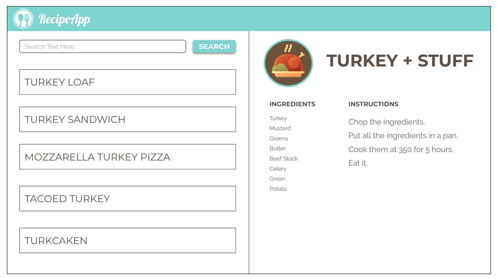

# Recipe App

Check out the image below: 

Work with your group to write down the steps involved in building this app (no peaking at the steps markdown!).

This is an important exercise. Complete this before you open the steps.md file and begin building your application. 

Components:
- App
    * Header
- Recipe Search
    * Form Input
    * Results component
        - Recipe display cards ie:  all turkey items
- Display
    * Seed database with recipes
- Methods
    * take in the input
    * find matching recipes
    * display recipe
    * print recipe 